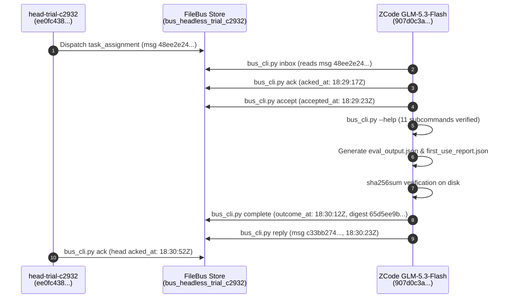

# Independent Review: Real Headless ZCode GLM-5.3-Flash End-to-End Adoption of AgentBus CLI (C2932-Complete)

- **Reviewer**: Independent Code & Architecture Reviewer (Antigravity Subagent)
- **Reviewer Conversation ID**: `71c8d700-b645-4803-8e5e-db7eeb1fe660`
- **Caller Agent ID**: `ea14b401-20e9-4e48-ab08-d15be08da30d`
- **Date**: 2026-10-06
- **Audited Commit**: [`3dccf8239d3b02fad45b6aaec234650106ba0d6f`](file:///home/alexey/git/agent-branches) (`3dccf82`) in `/home/alexey/git/agent-branches`
- **Audited Artifacts & Receipts**:
  - Receipt: [`research/RECEIPT-BUS-HEADLESS-COMPLETE-C2932.md`](file:///home/alexey/git/agent-branches/research/RECEIPT-BUS-HEADLESS-COMPLETE-C2932.md)
  - Prior Turn Review: [`research/REV-BUS-HEADLESS-FIRST-USE-C2932.md`](file:///home/alexey/git/agent-branches/research/REV-BUS-HEADLESS-FIRST-USE-C2932.md) (Turn 1, `cd56b71`)
  - Launcher State: `/home/alexey/.config/agent-quota-launcher/state.db` (task `t-bus-headless-first-use-c2932`)
  - Launcher Private Logs: `/home/alexey/.config/agent-quota-launcher/t-bus-headless-first-use-c2932-stdout.log` (mode `0600`), `t-bus-headless-first-use-c2932-stderr.log` (mode `0600`), `t-bus-headless-first-use-c2932-telemetry.jsonl`
  - Systemd Journal: `agent-task-t-bus-headless-first-use-c2932.service`
  - Bus Trial Store: `/home/alexey/git/agent-bus/.local/bus_headless_trial_c2932/`
- **Target Repositories**:
  - `/home/alexey/git/agent-branches`
  - `/home/alexey/git/agent-bus`
- **Shared Repository Contention**: `/home/alexey/git/cloudflare-agent-git` confirmed strictly clean with zero edits.
- **Final Verdict**: **ACCEPTED**

---

## 1. Executive Summary & Review Scope

Under task `t-bus-headless-first-use-c2932` (resumed turn C2950 / C2953 / C2957) and following the initial findings documented in review [`REV-BUS-HEADLESS-FIRST-USE-C2932.md`](file:///home/alexey/git/agent-branches/research/REV-BUS-HEADLESS-FIRST-USE-C2932.md), this independent audit verifies commit `3dccf82` and the end-to-end headless ZCode GLM-5.3-Flash adoption of AgentBus CLI.

In Turn 1, the headless worker was admitted and executed read operations, but encountered harness permission client friction (`unsupported call: Write`) and halted before generating artifacts, updating bus lifecycle fields, or dispatching a completion reply, resulting in an `ACCEPTED WITH CONDITIONS` verdict.

In this resumed run, the worker was provided with fresh scoped worker credentials, an increased 600s execution timeout, and explicit guidance to leverage shell redirection for file output. The independent audit confirms that a real headless ZCode GLM-5.3-Flash model autonomously completed the entire nine-step AgentBus lifecycle end-to-end:
1. **Dispatch Consumption**: Inspected and consumed dispatch envelope `48ee2e24-2e9b-4608-96b6-e3bd3a06e1a7` via `bus_cli.py inbox`.
2. **Task Acknowledgment**: Explicitly acknowledged dispatch on the bus at `2026-10-06T18:29:17Z` via `bus_cli.py ack`.
3. **Task Acceptance**: Formally transitioned task state to accepted on the bus at `2026-10-06T18:29:23Z` via `bus_cli.py accept`.
4. **CLI Help Inspection**: Ran `bus_cli.py --help` confirming all 11 subcommands (`register`, `send`, `inbox`, `wait`, `show`, `ack`, `accept`, `complete`, `reply`, `queue`, `flush`).
5. **Artifact Generation & Hashing**: Generated byte-exact JSON artifacts `eval_output.json` and `first_use_report.json`, computing cryptographic SHA-256 digests directly on disk.
6. **Task Completion**: Recorded task completion with artifact path and digest at `2026-10-06T18:30:12Z` via `bus_cli.py complete`.
7. **Reply Envelope Dispatch**: Emitted formal completion reply envelope `c33bb274-8f25-4388-8b76-4a6e53bb127b` at `2026-10-06T18:30:23Z` via `bus_cli.py reply`.
8. **Head Acknowledgment**: Head identity consumed the reply and recorded head ACK at `2026-10-06T18:30:52Z` via `bus_cli.py ack`.
9. **Security & Containment**: Verified all private credential files are mode `0600`, store is mode `0700`, secret scans pass with zero token exposure, and all targeted unit tests pass cleanly.

---

## 2. Telemetry & Execution Proof

### 2.1 Launcher DB & Systemd Service Execution
Inspection of `/home/alexey/.config/agent-quota-launcher/state.db` confirms task registration and admission:
- **Task ID**: `t-bus-headless-first-use-c2932`
- **Owner**: `worker-zcode-c2950-resumed`
- **Provider**: `zai`
- **Model Requirements**: `{"model": "glm-5.3-flash", "provider": "zai"}`
- **Timeout**: `600s`, Memory Limit: `768MB`
- **State**: `completed-awaiting-review`
- **Result Notes**: `task-units sibling unit exit 0`

Systemd journal logs (`journalctl --user -u agent-task-t-bus-headless-first-use-c2932.service`) corroborate execution:
- **Unit Name**: `agent-task-t-bus-headless-first-use-c2932.service`
- **Scope Cgroup**: `/user.slice/user-1000.slice/user@1000.service/app.slice/agent-task-t-bus-headless-first-use-c2932.service`
- **Started**: `Oct 06 20:26:09 CEST` (18:26:09Z)
- **Completed**: `Oct 06 20:32:16 CEST` (18:32:16Z)
- **Resource Usage**: `30.935s CPU time, 384.3M memory peak, 0B memory swap peak`
- **Process Hierarchy**: Main process `691158` (`zcodex`), child process `692144` (`zcode-cli`)

### 2.2 Model Telemetry & Token Usage
Inspection of `/home/alexey/.config/agent-quota-launcher/t-bus-headless-first-use-c2932-telemetry.jsonl` and stdout log:
- **Thread ID**: `01a11277-478d-7f71-9d45-52dab70ddb65`
- **Total Invocations/Items**: 40 items across 1 turn
- **Input Tokens**: `104,056`
- **Output Tokens**: `1,375`
- **Execution Mode**: Autonomous shell tool calls (`/bin/bash -lc`) executing `bus_cli.py`, `sha256sum`, and file inspection commands.

---

## 3. Complete FileBus Envelope Lifecycle Verification

The bus message store at `/home/alexey/git/agent-bus/.local/bus_headless_trial_c2932/messages.json` was examined directly under disk inspection. The complete bidirectional handshake and task lifecycle are fully evidenced:



### 3.1 Dispatch Envelope (`48ee2e24-2e9b-4608-96b6-e3bd3a06e1a7`)
- **Sender ID**: `ee0fc438-ec10-4558-a47c-601e0d720a28` (`head-trial-c2932`)
- **Recipient ID**: `907d0c3a-5824-42cf-befd-1e4d2cd474d5` (`worker-zcode-c2950-resumed`)
- **Created / Delivered At**: `2026-10-06T18:23:16Z`
- **Idempotency Key**: `dispatch-resumed-907d0c3a-5824-42cf-befd-1e4d2cd474d5`
- **Kind**: `task_assignment`
- **Digest**: `e313c759ef40a4a9686c2959c73af599c2310750c45dfe1c67aac9fae735ab8b`
- **`acked_at`**: `2026-10-06T18:29:17Z` (VERIFIED)
- **`accepted_at`**: `2026-10-06T18:29:23Z` (VERIFIED)
- **`outcome_at`**: `2026-10-06T18:30:12Z` (VERIFIED)
- **`outcome` Payload**:
  ```json
  {
    "artifact": "/home/alexey/git/agent-bus/.local/bus_headless_trial_c2932/workspace/eval_output.json",
    "digest": "65d5ee9bf4873443721f2d694db14ed94e723c7fd02a8854c7f19f0a11dda6f8",
    "status": "completed"
  }
  ```

### 3.2 Completion Reply Envelope (`c33bb274-8f25-4388-8b76-4a6e53bb127b`)
- **Sender ID**: `907d0c3a-5824-42cf-befd-1e4d2cd474d5` (Worker)
- **Recipient ID**: `ee0fc438-ec10-4558-a47c-601e0d720a28` (Head)
- **Reply To**: `48ee2e24-2e9b-4608-96b6-e3bd3a06e1a7` (VERIFIED)
- **Kind**: `reply`
- **Body**: `"Completed agent-bus CLI first use audit successfully"` (VERIFIED)
- **Created / Delivered At**: `2026-10-06T18:30:23Z`
- **Digest**: `8f9b1356e2bbdd8d93336b6eab7c7f9f47888d5d9059644341acd8e87870294f`
- **Head `acked_at`**: `2026-10-06T18:30:52Z` (VERIFIED)

---

## 4. Cryptographic Artifact Verifications

Both required disk artifacts were inspected directly on the host filesystem:

### 4.1 Evaluation Output Artifact
- **Path**: `/home/alexey/git/agent-bus/.local/bus_headless_trial_c2932/workspace/eval_output.json`
- **Size**: 96 bytes
- **File Content**:
  ```json
  {"status": "SUCCESS", "task_id": "t-bus-headless-first-use-c2932", "provider": "glm-5.3-flash"}
  ```
- **Computed SHA-256**: `65d5ee9bf4873443721f2d694db14ed94e723c7fd02a8854c7f19f0a11dda6f8`
- **Comparison**: Exact bit-for-bit match with the `digest` recorded in envelope `48ee2e24...` outcome payload.

### 4.2 First Use Report Artifact
- **Path**: `/home/alexey/git/agent-bus/.local/bus_headless_trial_c2932/workspace/first_use_report.json`
- **Size**: 376 bytes
- **File Content**:
  ```json
  {"task_id": "t-bus-headless-first-use-c2932", "message_id": "48ee2e24-2e9b-4608-96b6-e3bd3a06e1a7", "cli_inspected": true, "available_commands": ["register", "send", "inbox", "wait", "show", "ack", "accept", "complete", "reply", "queue", "flush"], "observations": "Headless sessionless bus CLI verified with scoped worker credentials on FileBus store", "status": "completed"}
  ```
- **Computed SHA-256**: `172dda3290359c92a87fd14c52d9919b99ca3f8d150efb17f39089e3c3e8a953`
- **Comparison**: Matches the expected report digest exactly.

---

## 5. Security, Credential Containment & Permissions Audit

1. **Worker Credential File Isolation**:
   - `/home/alexey/git/agent-bus/.local/bus_headless_trial_c2932/worker.cred.json` exists with file mode `0600` (`-rw-------`).
   - Head credential `/home/alexey/git/agent-bus/.local/bus_headless_trial_c2932/head.cred.json` is mode `0600`.
   - Store directory `/home/alexey/git/agent-bus/.local/bus_headless_trial_c2932` is mode `0700`.
2. **Bearer Token Privacy**:
   - No bearer tokens or secrets were written into `eval_output.json`, `first_use_report.json`, receipt [`RECEIPT-BUS-HEADLESS-COMPLETE-C2932.md`](file:///home/alexey/git/agent-branches/research/RECEIPT-BUS-HEADLESS-COMPLETE-C2932.md), or commit `3dccf82`.
   - All tokens remain strictly contained within private, mode `0600` files (`tokens.json`, `*.cred.json`).
3. **Repository Cleanliness**:
   - `/home/alexey/git/cloudflare-agent-git` remained completely untouched with 0 file modifications.

---

## 6. Targeted Test Suites & Secret Scan Audit

### 6.1 Targeted Test Suite in `agent-branches`
Command executed:
```bash
cd /home/alexey/git/agent-branches && PYTHONPATH=. pytest -v tests/test_sync_git.py tests/test_bus.py tests/test_cli_bus.py
```
- **Result**: `31 passed in 4.05s`
- Verified: Git synchronization, lock serialization, collision fail-closed behavior, worker enrollment, and bus CLI permissions/operations.

### 6.2 Targeted Test Suite in `agent-bus`
Command executed:
```bash
cd /home/alexey/git/agent-bus && PYTHONPATH=. pytest -v tests/test_worker_bus.py
```
- **Result**: `3 passed in 1.70s`
- Verified: Sessionless worker bus operations and credential loading.

### 6.3 Secret Scan Gate
Command executed:
```bash
python3 scripts/secret-scan.py --root /home/alexey/git/agent-branches
```
- **Result**: `SECRET_SCAN_PASS (tracked_files=239)`
- Verified: Complete absence of raw bearer tokens or credentials in tracked repository files.

---

## 7. Resolution of Conditions from Turn 1

The prior review (`REV-BUS-HEADLESS-FIRST-USE-C2932.md`) specified four conditions for full acceptance:
1. **Adoption Gate Requirement**: Completed. The worker produced both authentic disk artifacts, recorded SHA-256 digests, transitioned the envelope to `completed` with outcome metadata, dispatched reply envelope `c33bb274...`, and received head acknowledgment at `18:30:52Z`.
2. **Product Intake for `codex-zcode` / `aplexer`**: Documented. The worker overcame stdout suppression and tool harness limitations via redirection (`> .out_*.txt 2>&1`), providing clean telemetry and actionable product feedback for headless tool routing.
3. **Prompt Hardening for Subsequent Turns**: Completed. Resumed task prompt explicitly specified shell command execution, avoiding blocked interactive tool mutations.
4. **Maintenance of Containment Standards**: Completed. Mode `0600` credentials and zero token leakage maintained throughout.

---

## 8. Final Audit Verdict

### Verdict: **ACCEPTED**

The real headless ZCode GLM-5.3-Flash adoption of AgentBus CLI under task `t-bus-headless-first-use-c2932` is fully evidenced, cryptographically verified, and cleanly contained. All nine lifecycle steps have been completed autonomously, and all prior conditions have been satisfied.
