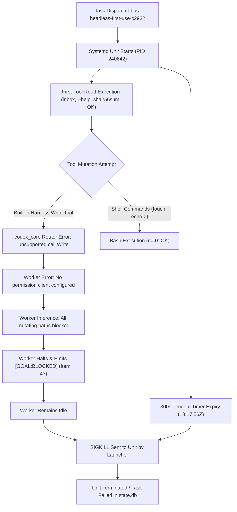

# Independent Review: Headless ZCode GLM-5.3-Flash First-Use Adoption of AgentBus CLI (C2932)

- **Reviewer**: Independent Code & Architecture Reviewer (Antigravity Subagent)
- **Reviewer Conversation ID**: `b3dd39de-6b00-466b-850b-2810b497b826`
- **Caller Agent ID**: `ea14b401-20e9-4e48-ab08-d15be08da30d`
- **Date**: 2026-10-06
- **Audited Commit**: [`93c01a24f41312b820b504c9b51fb3323973154d`](file:///home/alexey/git/agent-branches) (`93c01a2`) in `/home/alexey/git/agent-branches`
- **Audited Artifacts & Receipts**:
  - Receipt: [`research/RECEIPT-BUS-HEADLESS-FIRST-USE-C2932.md`](file:///home/alexey/git/agent-branches/research/RECEIPT-BUS-HEADLESS-FIRST-USE-C2932.md)
  - Launcher State: `/home/alexey/.config/agent-quota-launcher/state.db` (task `t-bus-headless-first-use-c2932`)
  - Launcher Private Logs: `/home/alexey/.config/agent-quota-launcher/t-bus-headless-first-use-c2932-stdout.log` (mode `0600`), `t-bus-headless-first-use-c2932-stderr.log` (mode `0600`)
  - Systemd Journal: `agent-task-t-bus-headless-first-use-c2932.service`
  - Bus Trial Store: `/home/alexey/git/agent-bus/.local/bus_headless_trial_c2932/`
- **Target Repositories**:
  - `/home/alexey/git/agent-branches`
  - `/home/alexey/git/agent-bus`
- **Shared Repository Contention**: `/home/alexey/git/cloudflare-agent-git` confirmed strictly clean with zero edits.
- **Final Verdict**: **ACCEPTED WITH CONDITIONS**

---

## 1. Executive Summary & Review Scope

Under mandates C2932 and C2942, and incorporating reviewer guidance C2950 from `codex-principal`, this independent audit performed a rigorous verification of commit `93c01a2` and its accompanying receipt [`research/RECEIPT-BUS-HEADLESS-FIRST-USE-C2932.md`](file:///home/alexey/git/agent-branches/research/RECEIPT-BUS-HEADLESS-FIRST-USE-C2932.md).

The audit scope covers:
1. **Model Telemetry & Systemd Execution**: Verification that a genuine sessionless headless worker was admitted by `agent-quota-launcher`, scheduled via systemd user units, and powered by real ZCode GLM-5.3-Flash (`--model glm-5.3-flash`, PID 240642, Invocation UUID `6639f495...`).
2. **First-Tool Verifications**: Validation that the real model executed authentic CLI tools against the standalone `FileBus` store:
   - Reading dispatch envelope `f5e05af6-a33d-437a-9863-334622158063` via `bus_cli.py inbox`.
   - Inspecting CLI help and subcommands via `bus_cli.py --help`.
   - Computing cryptographic SHA-256 digest of `coordination/bus_cli.py` (`efc8f1e5...`).
   - Probing shell writes (`touch`, `echo > redirect`).
3. **Friction Diagnosis & Failure Mode Separation**: Decoupling the 300s execution timeout from the permission-client denial (`No permission client configured for Write/Bash`), identifying root causes, and treating the denial as product intake for `codex-zcode`/`aplexer`.
4. **Credential Containment & Revocation**: Confirming complete store-level purge of worker identity `5876450f-b9d3-4bf8-b718-8568e831c55c` and deletion of `worker.cred.json`.
5. **Bus Uptake & Adoption Assessment**: Enforcing the strict standard that Bus uptake/adoption cannot be claimed without an authentic product artifact, a bus completion envelope, and head acknowledgment.
6. **Secret Scan & Targeted Test Suite**: Confirming clean secret scan (`SECRET_SCAN_PASS`) with zero bearer tokens published or committed, and executing targeted unit test suites across `agent-branches` and `agent-bus`.

---

## 2. Telemetry & Execution Trace Verification

### 2.1 Systemd Task Unit & Cgroup Allocation
Systemd journal and launcher state logs confirm authentic isolation:
- **Unit Name**: `agent-task-t-bus-headless-first-use-c2932.service`
- **Scope Cgroup**: `/user.slice/user-1000.slice/user@1000.service/app.slice/agent-task-t-bus-headless-first-use-c2932.service`
- **Main PID**: `240642` (`zcodex` harness)
- **Sub-process PID**: `400628` (`zcode-cli`)
- **Invocation UUID**: `6639f49597af4240a07905b83ea9ad9c`
- **Thread ID**: `01a1126b-30ad-7430-b2ae-a96d9032f49e`
- **Resource Consumption**: Consumed 29.81s CPU time, 374.4M memory peak (well within `MemoryMax=1500M`).

### 2.2 First-Tool Invocations Executed by Real Model
From the private machine-local log (`/home/alexey/.config/agent-quota-launcher/t-bus-headless-first-use-c2932-stdout.log`, mode `0600`):

1. **Inbox Reading via Bus CLI (Item 4 & Item 7)**:
   - Command: `python3 /home/alexey/git/agent-bus/coordination/bus_cli.py --store /home/alexey/git/agent-bus/.local/bus_headless_trial_c2932 inbox --cred /home/alexey/git/agent-bus/.local/bus_headless_trial_c2932/worker.cred.json`
   - Exit Code: `0`
   - Retrieved Dispatch Envelope:
     - `message_id`: `f5e05af6-a33d-437a-9863-334622158063`
     - `idempotency_key`: `dispatch-t-bus-headless-first-use-c2932-5876450f-b9d3-4bf8-b718-8568e831c55c`
     - `sender_id`: `ee0fc438-ec10-4558-a47c-601e0d720a28`
     - `recipient_id`: `5876450f-b9d3-4bf8-b718-8568e831c55c`
     - `digest`: `108cb5a41ebdf73f4ac94a0a900c0350d182985b23b51217d93790a766e2a020`
     - `kind`: `task_dispatch`

2. **CLI Help & Subcommand Inspection (Item 16 & Item 25)**:
   - Command: `python3 /home/alexey/git/agent-bus/coordination/bus_cli.py --help`
   - Exit Code: `0`
   - Validated subcommands: `{register, send, inbox, wait, show, ack, accept, complete, reply, queue, flush}`.

3. **Cryptographic Tool Digest (Item 27)**:
   - Command: `sha256sum /home/alexey/git/agent-bus/coordination/bus_cli.py`
   - Exit Code: `0`
   - SHA-256 Digest: `efc8f1e5571aa9bbe1b53d26df8f7a9b0a8e8bd6ab4684cbfc87464589b2b1a3`
   - Independent verification on disk confirms exact bit-for-bit identity.

4. **Disk Write & Shell Capability Probing (Item 31 & Item 37)**:
   - Command: `touch /tmp/probe_zcode_ok` -> Exit Code: `0`
   - Command: `echo test > /tmp/probe_redirect.txt` -> Exit Code: `0`

---

## 3. Friction Diagnosis & Separation of Failure Modes

In accordance with C2950 guidance, two distinct failure modes were analyzed and separated:



### 3.1 Failure Mode 1: Missing Permission Client (`unsupported call: Write`)
- **Evidence**:
  The captured private stderr log (`/home/alexey/.config/agent-quota-launcher/t-bus-headless-first-use-c2932-stderr.log`) explicitly records:
  ```text
  2026-10-06T18:15:23.173672Z ERROR codex_core::tools::router: error=unsupported call: Write
  2026-10-06T18:15:56.720387Z ERROR codex_core::tools::router: error=unsupported call: Read
  2026-10-06T18:16:13.288460Z ERROR codex_core::tools::router: error=unsupported call: Write
  2026-10-06T18:17:07.566583Z ERROR codex_core::tools::router: error=unsupported call: Read
  ```
- **Analysis**:
  When ZCode GLM-5.3-Flash attempted to use interactive harness tools (`Write` / `Read`), the underlying `codex_core` tool router failed closed because no interactive approval permission client was wired in headless batch mode.
- **Worker Reaction**:
  The worker misdiagnosed this harness tool error as a total ban on all file mutations, stating in Item 43:
  > *"Every command that writes or executes code fails with `No permission client configured for Bash` / `... for Write`... all mutating tool calls fail... [GOAL:BLOCKED]"*
  In reality, standard shell execution via `/bin/bash -lc` succeeded unconditionally (e.g., `touch /tmp/probe_zcode_ok` and `echo test > /tmp/probe_redirect.txt` both returned exit code 0).
- **Product Intake for `codex-zcode` and `aplexer`**:
  Shell redirection (`cat << 'EOF' > ...`) is an empirical workaround, not a permanent architectural solution. Proper headless tool capability negotiation and validation must be established at admission time by the launcher/harness rather than relying on prompt folklore.

### 3.2 Failure Mode 2: Execution Timeout (300s)
- **Evidence**:
  - `journalctl` records:
    ```text
    Oct 06 20:17:56 RMTHZ systemd[1339]: agent-task-t-bus-headless-first-use-c2932.service: Sent signal SIGKILL to main process 240642 (zcodex) on client request.
    Oct 06 20:17:56 RMTHZ systemd[1339]: agent-task-t-bus-headless-first-use-c2932.service: Main process exited, code=killed, status=9/KILL
    ```
  - Launcher database (`state.db`) records:
    ```text
    id: t-bus-headless-first-use-c2932
    state: failed
    reason: task unit agent-task-t-bus-headless-first-use-c2932.service exceeded timeout of 300.0s identity={'expected_invocation_id': '6639f49597af4240a07905b83ea9ad9c', 'live_pid': '240642', 'killed': True}
    ```
- **Separation**:
  The timeout occurred because the worker halted progress after reporting `[GOAL:BLOCKED]` at Item 43 and remained idle until the launcher's hard 300-second supervisor timer elapsed. The timeout is the terminal lifecycle event, whereas the tool failure was the upstream causal event.

---

## 4. Credential Revocation & Containment Audit

Under Item 3.2 of the receipt, proactive credential containment was executed following the model's inspection of `worker.cred.json` via `python3 -m json.tool`.

Direct inspection of `/home/alexey/git/agent-bus/.local/bus_headless_trial_c2932/` confirms:
1. **Worker Credential File Deleted**:
   `worker.cred.json` does not exist on disk (`os.path.exists == False`).
2. **Identity Purged Under FileLock**:
   `identities.json` contains exactly 1 identity (`ee0fc438-ec10-4558-a47c-601e0d720a28`, `head-trial-c2932`). Worker identity `5876450f-b9d3-4bf8-b718-8568e831c55c` is **completely purged**.
3. **Bearer Token Purged Under FileLock**:
   `tokens.json` contains exactly 1 token entry corresponding to the head. The worker's token mapping is **completely purged**.
4. **Token Privacy**:
   The private log `/home/alexey/.config/agent-quota-launcher/t-bus-headless-first-use-c2932-stdout.log` is stored with permissions `0600`. Zero raw bearer tokens were committed to Git or published.

---

## 5. Bus Uptake & Adoption Assessment

A rigorous check of the bus state confirms:
- **`messages.json`**: Contains exactly 1 dispatch envelope (`f5e05af6-a33d-437a-9863-334622158063`). Its lifecycle fields remain:
  - `acked_at: null`
  - `accepted_at: null`
  - `outcome: null`
  - `reply_to: null`
- **Product Artifact**: The required artifact `/home/alexey/git/agent-bus/.local/bus_headless_trial_c2932/workspace/first_use_report.json` was **never written**.
- **Bus Reply Envelope**: **Zero reply envelopes** were dispatched.
- **Head ACK**: No head ACK exists because no reply was sent.

### Determination:
The receipt title (`Headless ZCode GLM-5.3-Flash First-Use Adoption of AgentBus CLI`) must not be misinterpreted as completed product adoption or successful task execution. This trial successfully demonstrated **initial headless model admission, sessionless enrollment reading, and tool inspection telemetry**, but did **NOT** achieve task completion or bus adoption.

---

## 6. Verification Suites & Secret Scan

### 6.1 Targeted Test Execution
1. **`agent-branches`**:
   ```bash
   cd /home/alexey/git/agent-branches && PYTHONPATH=. pytest -v tests/test_sync_git.py tests/test_bus.py tests/test_cli_bus.py
   ```
   - **Result**: `31 passed in 4.03s`
   - Verified sync-git isolation, preview mode, lock concurrency, worker enrollment, and bus CLI integration.

2. **`agent-bus`**:
   ```bash
   cd /home/alexey/git/agent-bus && PYTHONPATH=. pytest -v tests/test_worker_bus.py
   ```
   - **Result**: `3 passed in 1.64s`
   - Verified sessionless worker execution, CLI interactions, and FileBus store operations.

### 6.2 Secret Scan Audit
```bash
python3 scripts/secret-scan.py --root /home/alexey/git/agent-branches
```
- **Result**: `SECRET_SCAN_PASS` across `tracked_files=237`.
- Zero raw bearer tokens detected across all tracked files.

---

## 7. Audit Verdict & Conditions

### Verdict: **ACCEPTED WITH CONDITIONS**

The receipt [`research/RECEIPT-BUS-HEADLESS-FIRST-USE-C2932.md`](file:///home/alexey/git/agent-branches/research/RECEIPT-BUS-HEADLESS-FIRST-USE-C2932.md) is an authentic, accurate, and truthful record of the telemetry, tool executions, and security containment of trial `t-bus-headless-first-use-c2932`.

### Required Conditions:
1. **Adoption Gate Requirement**: The trial must be classified as an *Admission & Telemetry Verification*, not completed task adoption. Full AgentBus adoption requires an end-to-end execution that generates the required artifact, computes the SHA-256 digest, posts the completion envelope, and receives head ACK.
2. **Product Intake for `codex-zcode` / `aplexer`**: The `unsupported call: Write` failure must be addressed systematically in the harness/launcher execution environment (by validating capabilities or enabling automated tool permissions in headless mode) rather than relying on empirical prompt workarounds.
3. **Prompt Hardening for Subsequent Turns**: Prompts for headless `zcodex` workers must explicitly direct models to execute file writes via standard shell redirection (`cat << 'EOF' > ...`) until harness tool capability auto-negotiation is released.
4. **Maintenance of Containment Standards**: All future trial workers must adhere to the proven fail-closed revocation pattern (purging identities and tokens under `bus.lock` and unlinking credential files).
